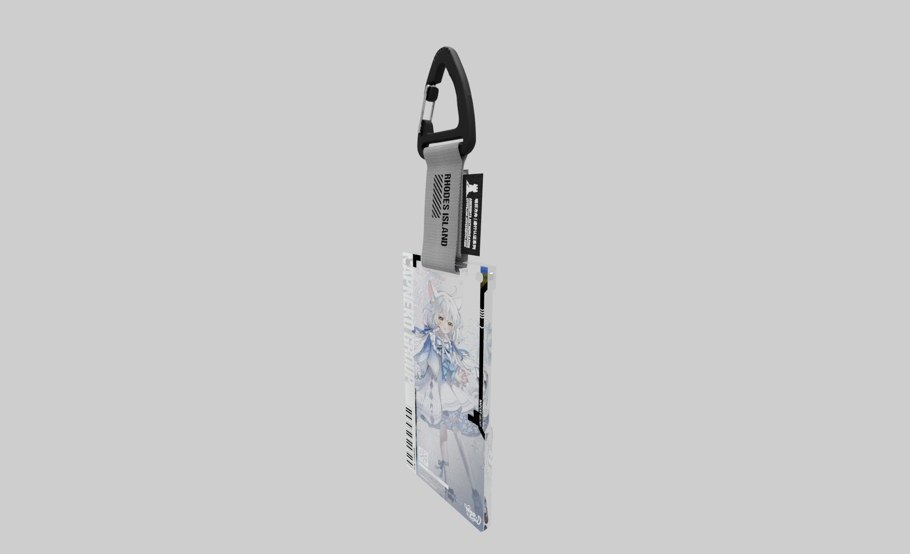

# Arknight Passport Viewer

<div align="center">
    
</div>
<br>

基于 Three.js 的明日方舟赛博通行证查看器，以四图层方式加载显示通行证。

## 快速开始

```bash
npm install
npm run dev
```

开发服务器启动后，默认访问地址为 `http://localhost:5173`。

## 渲染说明

- 调整是否使用路径追踪渲染：在 `src/main.ts` 中修改 `useWebGL` 变量。
- 修改加载的通行证贴图：在 `src/main.ts` 中修改 `texturesDir` 变量，渲染器将自动加载目录下固定名称为 `11.png`、`12.png`、`21.png`、`22.png` 的四张贴图进行渲染，它们分别为正面的正反和背面的正反贴图。
- 明日方舟通行证挂带颜色切换：在 `src/main.ts` 中修改 `accType` 变量，`'silver' | 'black'`。
- 终末地通行证兼容：你可以将 `src/main.ts` 中的 `modelsPrefix` 变量修改为 `zmd_`，以加载终末地通行证的模型与贴图。终末地模型暂未制作挂件的模型，目前不会显示挂件。

## 版权声明
[明日方舟](https://ak.hypergryph.com) 及 [明日方舟：终末地](https://endfield.hypergryph.com) 是 [鹰角网络](https://www.hypergryph.com) 旗下的两款游戏作品，游戏名称、通行证样式等相关元素均为鹰角网络的注册商标与版权内容。本项目对通行证相关周边产品进行建模与渲染展示，属于对游戏元素的二次创作，本项目代码遵循 AGPL-3.0 协议开源发布，模型与图片素材遵循 CC BY-SA 4.0 协议授权发布，均非商业用途。如有任何版权相关问题，请提出 issue 进行协商。

## 模型与图片素材声明


本项目中用于展示的模型与图片贴图素材（包括但不限于 `public/models/` 与 `public/textures/passport/` 下内容）采用 **Creative Commons Attribution-ShareAlike (CC BY-SA 4.0)** 协议进行授权发布。

你在使用、修改或再分发这些素材时，需要满足以下条件：

- Attribution（署名）：保留原作者/来源信息与协议声明
- ShareAlike（相同方式共享）：基于这些素材的衍生作品需采用相同或兼容协议发布

建议在二次分发时一并提供：

- 素材来源链接
- 原作者署名信息
- 协议链接：`https://creativecommons.org/licenses/by-sa/4.0/`

其中，`public/textures/passport/napcat` 下的贴图版权归 [Napcat](https://github.com/NapNeko/NapCatQQ) 所有，使用请额外取得 Napcat 的授权许可。
